# Mastra Framework — Architecture Diagrams

Modular AI agent framework. Central `Mastra` class wires agents, workflows, memory, storage, MCP, observability. Four levels of detail below.

> Rendered with Mermaid `flowchart` (cleaner auto-layout than native C4 shapes).

---

## Level 1 — System Context

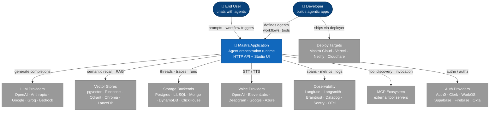

---

## Level 2 — Container

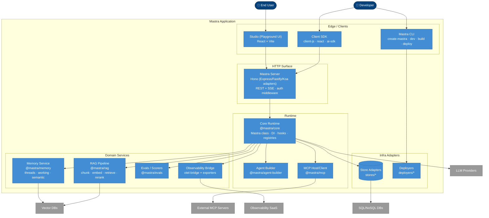

---

## Level 3 — Core Runtime Components

Internals of `@mastra/core`. Grouped by responsibility.

```mermaid
flowchart TB
    classDef hub fill:#F59E0B,stroke:#B45309,color:#fff,stroke-width:2px
    classDef comp fill:#85BBF0,stroke:#5D82A8,color:#000
    classDef abs fill:#C7D2FE,stroke:#6366F1,color:#000,stroke-dasharray: 4 2
    classDef evt fill:#FCA5A5,stroke:#B91C1C,color:#000

    subgraph CORE["@mastra/core"]
        direction TB

        Mastra["🎯 Mastra<br/>central DI container<br/>registers everything"]:::hub

        subgraph AGENTS["Agent Layer"]
            direction LR
            agent["Agent<br/>generate / stream"]:::comp
            tla["ToolLoopAgent<br/>lightweight variant"]:::comp
            loop["Loop Engine<br/>tool-call loop"]:::comp
            stream["Stream<br/>unified primitives"]:::comp
            proc["Processors<br/>guardrails · PII · transforms"]:::comp
        end

        subgraph TOOLING["Tools"]
            direction LR
            tools["ToolAction<br/>typed w/ Zod"]:::comp
            tprov["Tool Provider<br/>dynamic sources"]:::comp
            mcpMod["MCP Server/Client<br/>host + consume"]:::comp
        end

        subgraph MODEL["Model"]
            direction LR
            llmMod["LLM + Gateways<br/>model routing"]:::comp
        end

        subgraph STATE["State / Memory"]
            direction LR
            memAbs["MastraMemory<br/><<abstract>>"]:::abs
            storeAbs["MastraCompositeStore<br/><<abstract>>"]:::abs
            vecAbs["MastraVector<br/><<abstract>>"]:::abs
            cache["Server Cache"]:::comp
        end

        subgraph FLOW["Workflows"]
            direction LR
            wf["Workflow Engine<br/>step DAG · suspend/resume"]:::comp
            wfep["WorkflowEventProcessor"]:::evt
        end

        subgraph OPS["Ops"]
            direction LR
            obsMod["Observability<br/>spans · metrics · logger ctx"]:::comp
            hooks["Hooks + PubSub"]:::evt
            scorers["Scorers (evals)"]:::comp
            reqCtx["Request Context<br/>AsyncLocalStorage"]:::comp
            bg["Background Tasks"]:::comp
            datasets["DatasetsManager"]:::comp
            ws["Workspace"]:::comp
        end

        subgraph EDGE["Edge"]
            direction LR
            srvAbs["MastraServerBase<br/><<abstract>>"]:::abs
            bundler["Bundler + Deployer"]:::comp
            voiceAbs["MastraTTS / Voice<br/><<abstract>>"]:::abs
        end
    end

    Mastra --> agent
    Mastra --> wf
    Mastra --> memAbs
    Mastra --> storeAbs
    Mastra --> vecAbs
    Mastra --> mcpMod
    Mastra --> scorers
    Mastra --> voiceAbs
    Mastra --> srvAbs
    Mastra --> obsMod
    Mastra --> hooks
    Mastra --> bg
    Mastra --> datasets
    Mastra --> cache
    Mastra --> ws

    agent --> llmMod
    agent --> loop
    agent --> tools
    agent --> tprov
    agent --> memAbs
    agent --> proc
    agent --> voiceAbs
    agent --> stream
    agent --> reqCtx
    tla   --> agent

    wf    --> wfep
    wf    --> storeAbs
    wfep  --> hooks

    memAbs --> storeAbs
    memAbs --> vecAbs

    obsMod  --> hooks
    scorers --> hooks
    bundler --> srvAbs
```

---

## Level 4 — Agent Class

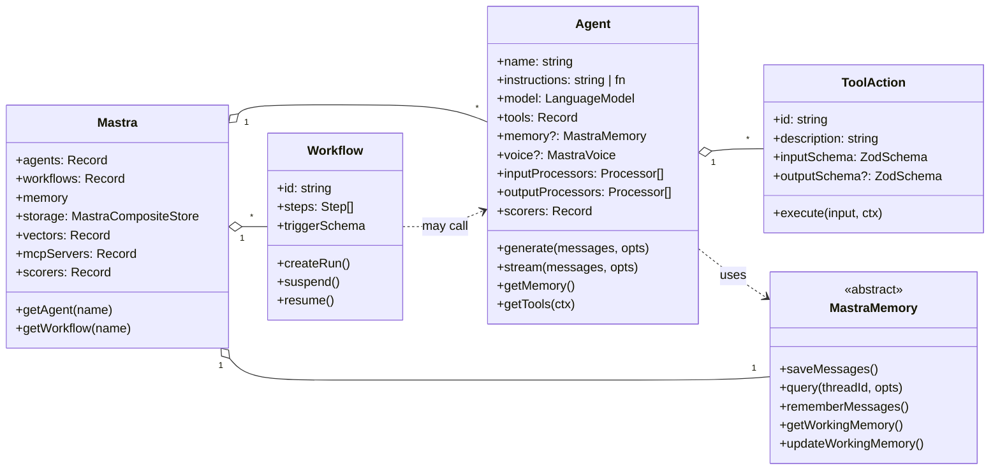

---

## Runtime Sequences

Dynamic views for major paths through Mastra. Each shows one realistic flow end-to-end.

---

### Seq 1 — Agent Stream: Memory + Tool Call + RAG

Most common path. User asks question → agent pulls history + RAG context → LLM decides tool call → loops → streams answer back.

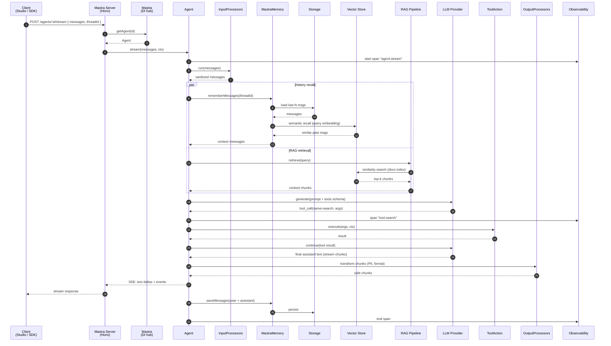

---

### Seq 2 — Workflow Execution: Suspend / Resume

Workflows are event-sourced step DAGs. Any step can suspend (wait for human/external signal) and resume later — state persisted to storage.

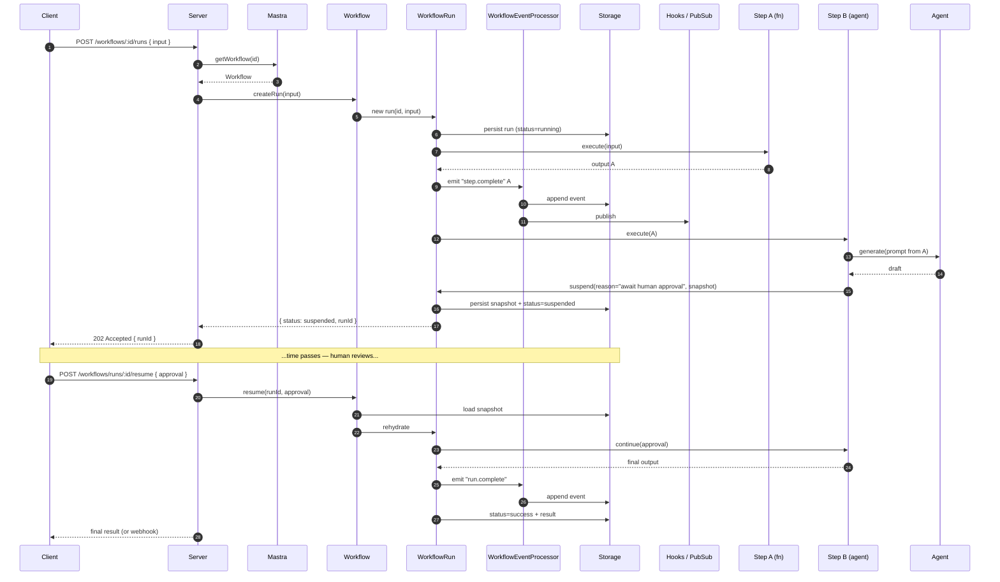

---

### Seq 3 — RAG Ingestion Pipeline

Developer indexes documents so agents can retrieve them. One-shot (or batch) path — not per-request.

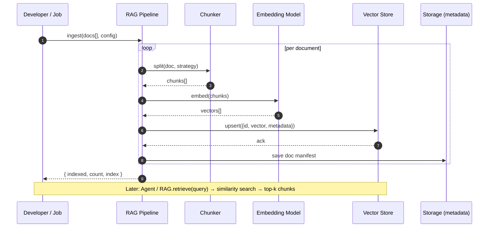

---

### Seq 4 — MCP Tool Discovery + Invocation

Mastra as MCP **client** — pulls tools from external MCP servers into agent's tool set at runtime.

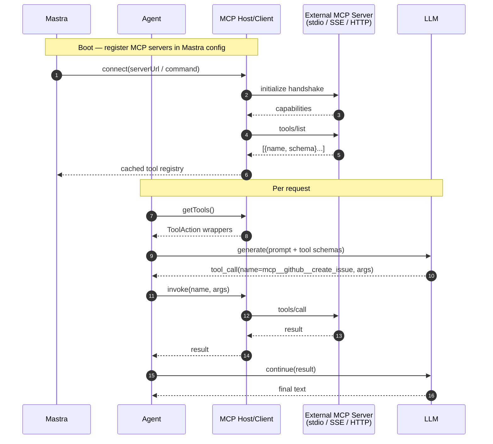

Inverse direction — Mastra as MCP **server** — expose agents/workflows as tools to external clients (Claude Desktop, Cursor, etc.):

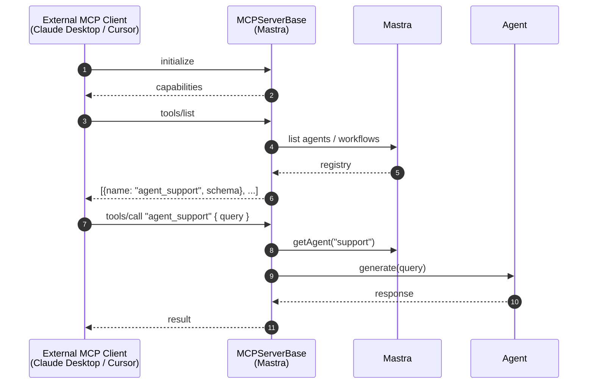

---

### Seq 5 — Evals / Scorer Hook

Scorers run async after agent run via hooks. Don't block response. Results persisted for dashboards.

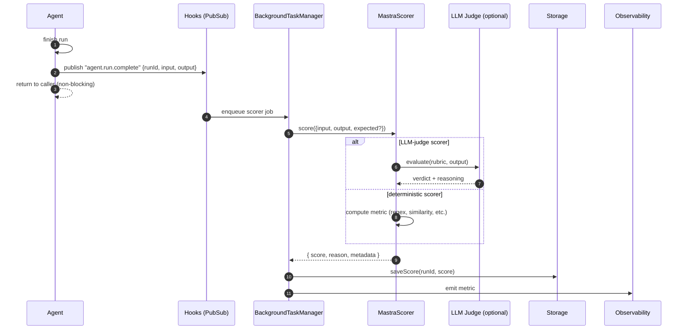

---

### Seq 6 — Voice (STT → Agent → TTS)

Full voice round-trip. Used by real-time agents.

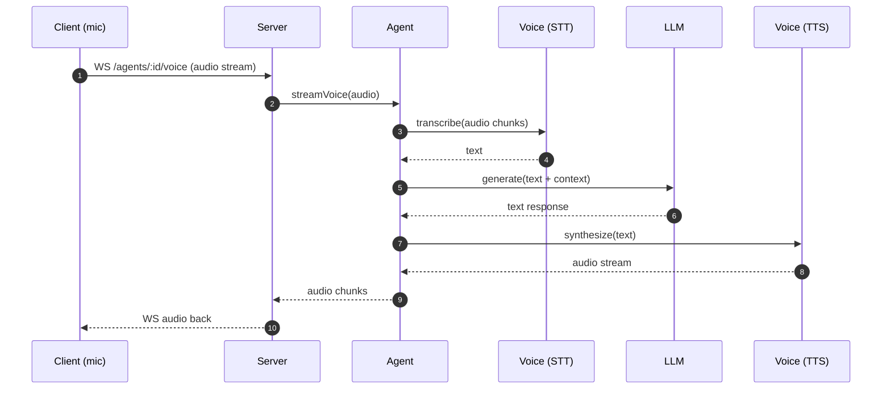

---

### Seq 7 — Deploy Flow (CLI → Deployer → Target)

Build-time path. Not runtime, but worth showing for ops.

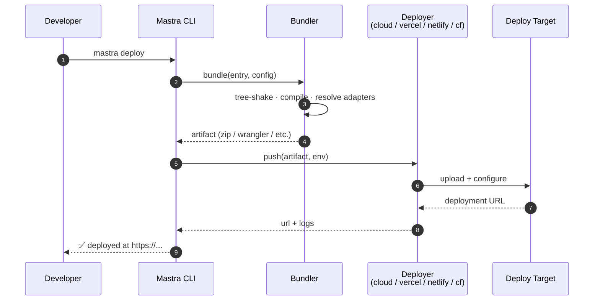

---

## Key Takeaways

- `Mastra` class = DI hub. Everything registered on it.
- `Agent` = instructions + model + tools + memory + processors. Runs tool-loop.
- `Workflow` = step DAG, suspend/resume, event-sourced via storage.
- Memory split: thread messages (storage) + semantic recall (vector) + working memory (storage).
- MCP dual-role: Mastra hosts MCP servers AND consumes them.
- Observability decouples via hooks + OTel bridge → many exporters.
- Stores / voice / deployers = pluggable adapters behind abstract interfaces.
